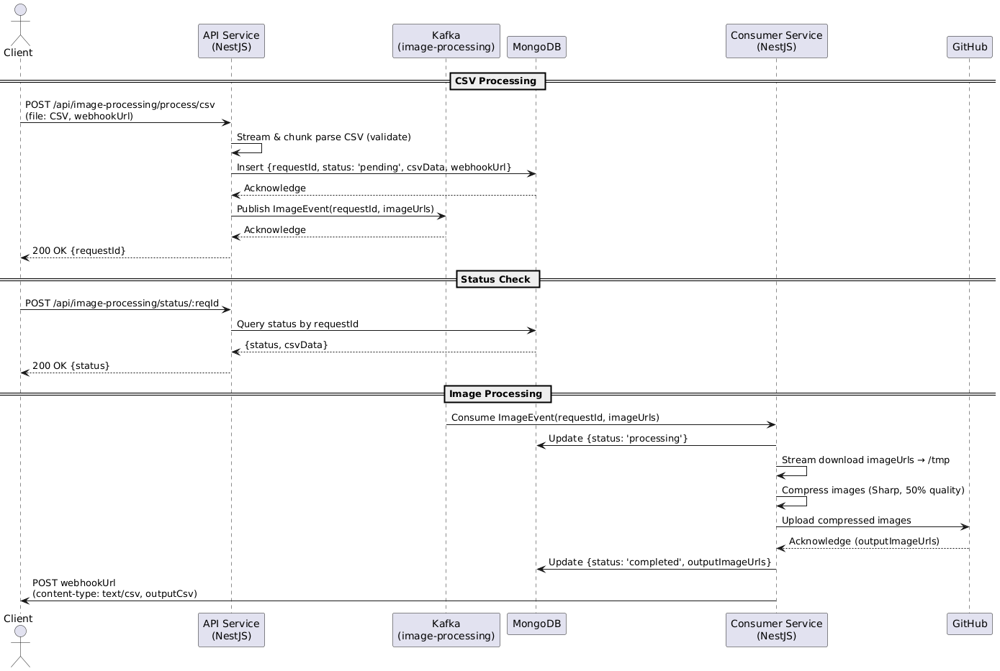

# Technical Design Document: Image Processing System

This document outlines the architecture, components, data flows, and implementation details of the system

## Project Overview

The Image Processing System is a microservices-based platform designed to handle image processing workflows triggered by structured data inputs (e.g., CSV files). It leverages event-driven architecture with Apache Kafka for scalability, ELK Stack for logging and observability, and MongoDB for persistent storage, ensuring efficiency, reliability, fault tolerance, and ease of maintenance.

## High Level Design (HLD)

### System Architecture
The system follows a microservices architecture with event-driven communication, integrating Kafka for streaming, MongoDB for persistence, and ELK for observability. Key components include:

- **API Service:** Entry point for data ingestion (e.g., CSV uploads).
- **Kafka Cluster:** Core event streaming and coordination backbone.
- **Schema Registry:** Manages data schemas for consistency. (AVRO schema)
- **Consumer Service:** Processes image events and stores results.
- **MongoDB:** Stores metadata and processing states.
- **ELK Stack:**
  - **Elasticsearch:** Indexes logs and metrics for search (via APM agent).
  - **Kibana:** Visualizes logs and system health.
- **Kafka UI:** Monitors Kafka cluster and topics.
- **GitHub Repository:** External storage for processed images.

### Architecture Diagram


### Data Flow
- **Client:** Submits data and registers webhooks, and checks for status via API.
- **API Service:** Publishes events to Kafka, stores status, input data, and webhook config to MongoDB.
- **Kafka Cluster:** Routes events to Consumer.
- **Consumer Service:** Processes images, updates MongoDB, uploads file to github, and triggers webhooks to sends notifications to client.
- **MongoDB:** Stores input data, output data and webhook subscriptions.
- **ELK:** Provides logging and observability.
- **Kafka UI:** Provides monitoring for Kafka state.

### Design Principles

**Scalability:** Kafka partitions, service replicas, webhook fan-out.
**Efficiency:** Asynchronous processing, optimized storage and notifications.
**Reliability:** Kafka replication, MongoDB durability, webhook retries.
**Fault Tolerance:** Dead-letter queues, retry mechanisms, service restarts.
**Maintainability:** Modular design, centralized logging, UI monitoring.

## Low-Level Design (LLD)

### Components

#### 1. Database

**Database Justification**: The choice of MongoDB as the primary database for the Image Processing System is driven by the nature of the input data and the system’s current requirements. At present, the data is inherently non-relational—attributes such as product details or image URLs lack independent entity status and derive meaning only when associated with a unique requestId. This structure aligns seamlessly with MongoDB’s document-oriented model, where each processing request can be stored as a self-contained document.

Currently, the system treats requests as isolated units, with no need for complex relationships between entities like products or images. MongoDB’s document model naturally supports this by encapsulating all request-related data (e.g., metadata, image URLs, processing status) within a single, easily queryable document. This eliminates the overhead of relational database normalization and foreign key constraints, which would be unnecessary and inefficient given the non-relational nature of the data.

**Future Considerations**
Should requirements evolve to introduce relational data—such as registering products as standalone entities, associating requests with product IDs, or tracking relationships between images and categories—a relational database (e.g., PostgreSQL or MySQL) might become necessary.

This is the document schema:
```js
{
  requestId: { type: String, required: true, unique: true },
  status: { type: String, required: true, enum: ["Accepted", "Processing", "Failed", "Succeeded"] },
  message: { type: String, required: true },
  webhookUrl: { type: String, required: true },
  products: {
    type: Map,
    of: ProductSchema,
    required: true,
  }, // Record<productName, Product>
  createdAt: { type: Date, default: Date.now },
  updatedAt: { type: Date, default: Date.now },
}

// Product Schema
{
  name: { type: String, required: true },
  inputImageUrls: { type: [String], required: true, default: [] },
  outputImageUrls: { type: [String], default: [] },
}
```

#### API Service

**Technology:** NestJS (Node.js).
**API Endpoints:**
- POST /api/image-processing/process/csv:
  - Accepts structured data (multipart csv file).
  - Accepts `webhookUrl` as query param
  - Parses and Validates CSV data (stream & chunks parsing, instead of buffer for memory optimization)
  - Update Status and CSV data to DB corresponding to a requestId
  - Publishes event to Kafka
  - Returns the requestId
- POST /api/image-processing/status/:reqId: Registers webhook URLs.
  - Fetches the status for the give requestId from db.

#### Kafka Schema Design

The project uses AVRO encoding format for enforcing a strict schema to any message being pushed into Kafka Topic. Following is the AVRO schema for our topic:
```json
{
  "type": "record",
  "name": "ProductData",
  "fields": [
    {
      "name": "requestId",
      "type": "string",
      "logicalType": "uuid"
    },
    {
      "name": "webhookUrl",
      "type": "string"
    },
    {
      "name": "products",
      "type": {
        "type": "map",
        "values": {
          "type": "record",
          "name": "Product",
          "fields": [
            {
              "name": "name",
              "type": "string"
            },
            {
              "name": "inputImageUrls",
              "type": {
                "type": "array",
                "items": "string"
              }
            }
          ]
        }
      }
    }
  ]
}

```
Currently 3 **partitions** are configured for our topic among which data is divided equally by keeping request id as key, so at most 3 consumers can work simultaneously.
**Replication factor** currently defaults to 1 due to limited deployment resources, so the system is not in a fault tolerance mode right now.

#### Consumer Service
**Technology:** NestJs (Node.js, kafkajs, sharp, axios, mongodb).
**Input:** Kafka image-processing topic.
**Process:**
  - Images are downloaded from the specified inputImageUrls, and streamed to temp files (not stored in memory as buffer for memory optimization).
  - Then converted to 50% less quality using sharp
  - After conversion, processed images are uploaded to GitHub (for free storage), and outputImageUrls are stored to MongoDB
  - Finally a webhook is triggered with the output csv (content-type: text/csv) to notify the end user.

# Codebase & Deployment Architecture, Decisions, Cost Solutioning, & Process Document: Image Processing System

The Image Processing System is deployed on a Single Node (4vCPUs, 8GiB RAM, 100GB Storage) Google Kubernetes Engine (GKE) to leverage its managed Kubernetes capabilities for scalability, reliability, and ease of maintenance. This document details the deployment architecture, justifies key decisions, estimates operational costs, and provides a step-by-step deployment process. The system integrates Kafka for event streaming (deployed on cluster), MongoDB (Atlas free tier) for persistence and ELK Stack (elastic cloud free trial) for observability, with all components orchestrated as containerized workloads.

## Constraints

Cost is the major constraint as this is a demo project, so the system is optimized to work with minimal resources.

The GKE is funded by $200 free credits, and is optimized in a way that complete system would be able to work for 1 month.

## Architecture Overview

The system is deployed as a Kubernetes cluster on GKE, utilizing a single node pool with multiple pods for each microservice. Components are containerized using Docker images and orchestrated via Kubernetes resources (StatefulSets, Deployments, Services, ConfigMaps, Secrets).

## Codebase Overview

- The repository is designed as a monorepo powered by `yarn workspaces`, `lerna` and `nx`. The same codebase (hence the same image) serves for both API app, as well as Consumer App depending on the environment variables.
- In the monorepo `packages/*` are the custom written libraries for standardizing interactions to Database, Queues, Caches etc, the their corresponding NestJs Custom Module Wrappers.
- `app/*` is the core source code for the API and consumer application and is powered by NestJS following **Robert C. Martin's Clean Coding Principles** and adhering to **SOLID guidelines**.
- All the deployment configurations are present in the `./k8s` folder in form of **Helm Charts** for templating, packaging & releasing Kubernetes Manifests in an efficient, maintainable & reusable way
- `Dockerfile` is present in the root of the repository, which is a multi-staged dockerfile written in a very optimized manner.

## Components & Deployment Types

### GKE Cluster:
- **Type:** Standard cluster (not Autopilot, for cost control).
- **Node Pool:** Single pool, `c2d-highcpu-4` (4 vCPUs, 8 GiB memory).
- **Nodes:** 1 (scalable to 2+).
- **Estimated Cost for the setup**: \$197-\$200 for 1 month

### Kafka Stack

The Kafka Stack is combined into a single helm chart present at `./k8s/kafka-stack`. This chart can be deployed as follows:
```bash
kubectl create ns kafka
helm upgrade --install kafka k8s/kafka-stack -n kafka
```
This chart consists of the following components:

#### 1. Kafka Cluster
- **Type:** StatefulSet (for having stable pod identities for every broker).
- **Replicas:** 1 (scalable to 3+).
- **Storage:** PersistentVolumeClaim (PVC) with GKE standard StorageClass (1 GiB).
- **Service:** Headless (ports: 29092, 9092, 9997, 29093). Resultant Broker URL - `kafka-0.kafka.kafka.svc.cluster.local:29092`
- **Resources**
  ```yaml
  requests:
    memory: 768Mi
    cpu: 250m
  limits:
    memory: 1536Mi
    cpu: 500m
  ```
#### 2. Kafka Schema Registry:
- **Type:** StatefulSet (for leader election for multi-pod).
- **Replicas:** 1.
- **Service:** Headless (port: 8085). Resultant Registry URL - `http://kafka-schema-registry-0.kafka-schema-registry.kafka.svc.cluster.local:8085`
- **Resources**
  ```yaml
  resources:
    requests:
      memory: 256Mi
      cpu: 50m
    limits:
      memory: 512Mi
      cpu: 150m
  ```
#### 3. Kafka UI
- **Type:** Deployment (stateless).
- **Replicas:** 1.
- **Service:** NodePort (port: 8080). NodePort is chosen to save cost for having a LoadBalancer provisioned by GKE.
- **Resources**
  ```yaml
  resources:
    requests:
      memory: 256Mi
      cpu: 50m
    limits:
      memory: 512Mi
      cpu: 150m
  ```

### Application Deployment

- Application Deployment chart is present in `./k8s/csv-image-processing`. Api App is deployed in `api` namespace & consumer app is deployed in `consumer` namespace.
- Following are the commands for deploying application & consumer:
  ```bash
  # API app deployment
  kubectl create ns api
  kubectl create secret generic mongo-uri --from-literal MONGO_URI=<uri> -n api
  kubectl create secret generic apm-uri --from-literal APM_URI=<uri> -n api
  kubectl create secret generic apm-api-key --from-literal APM_API_KEY=<key> -n api
  kubectl create secret generic gh-pat-token --from-literal GH_PAT_TOKEN=<token> -n api
  helm upgrade --install csv-image-processing k8s/csv-image-processing -f k8s/csv-image-processing/api-app.yaml -n api

  # Consumer App Deployment
  kubectl create ns consumer
  kubectl create secret generic mongo-uri --from-literal MONGO_URI=<uri> -n consumer
  kubectl create secret generic apm-uri --from-literal APM_URI=<uri> -n consumer
  kubectl create secret generic apm-api-key --from-literal APM_API_KEY=<key> -n consumer
  kubectl create secret generic gh-pat-token --from-literal GH_PAT_TOKEN=<token> -n consumer
  helm upgrade --install csv-image-processing k8s/csv-image-processing -f k8s/csv-image-processing/consumer-app.yaml -n consumer
  ```
#### 1. Api Service
- **Type:** Deployment (stateless).
- **Replicas:** 2.
- **Service:** NodePort (port: 80). NodePort is chosen to save cost for having a LoadBalancer provisioned by GKE.
- **Resources**
  ```yaml
  resources:
    requests:
      memory: 256Mi
      cpu: 50m
    limits:
      memory: 512Mi
      cpu: 150m
  ```
#### 2. Consumer Service
- **Type:** Deployment (stateless).
- **Replicas:** 2.
- **Resources**
  ```yaml
  resources:
    requests:
      memory: 512Mi
      cpu: 250m
    limits:
      memory: 1536Mi
      cpu: 500m
  ```

### Total Resource Consumption
```yaml
resources:
  requests:
    memory: 2816Mi # 768 + 256 + 256 + 256*2 + 512*2
    cpu: 950m # 250 + 50 + 50 + 50*2 + 250*2
  limits:
    memory: 6656Mi # 1536 + 512 + 512 + 512*2 + 1536*2
    cpu: 2100m # 500 + 150 + 150 + 150*2 + 500*2
```